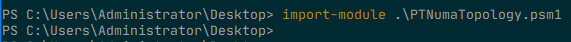
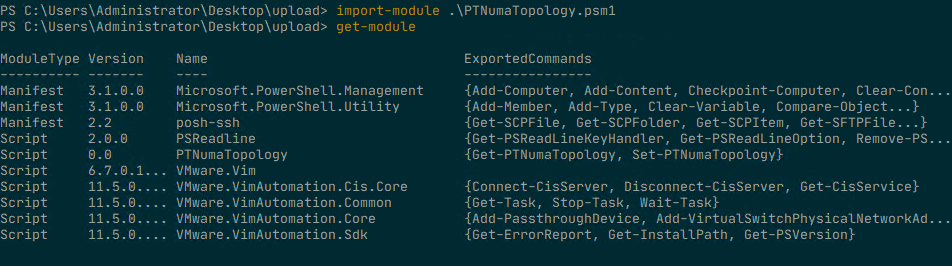
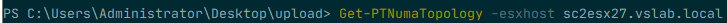
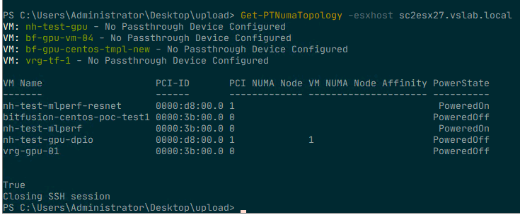
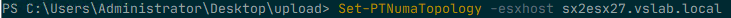
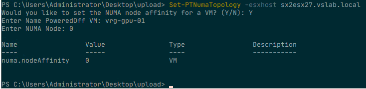
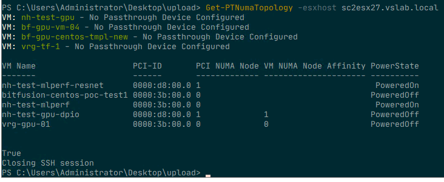

# Abstract

http://www.frankdenneman.nl will feature an extensive write-up soon.

# The Script Set
The purpose of this script module is to identify the PCIe Device to NUMA Node locality within a VMware ESXi Host and set the vCPU NUMA affinity accordingly to isolate the vCPU and Memory of the VM in the same domain as the GPU device. This module presents the NUMA topology of a PCI Device that is assigned as a PassThrough (PT) device to a virtual machine on the VMware vSphere platform, The Get function retrieves information of registered VMs, PCI-ID of passthrough devices configured, PCI device NUMA node, NUMA Node Affinity VM advanced setting and Powerstate of VM. The Set function provides the ability to set a NUMA Node affinity advanced setting of powered-off VMs

Please note that `Get-PTNumaTopology` function only collect information and do not alter any configuration in any way possible. The `Set-PTNumaTopology` function writes the advanced configuration setting `"numa.affinity"` and a value to the VMX file of a powered-off VM.

## Requirements
* VMware PowerCLI
* Connection to VMware vCenter
* Unrestricted Script Execution Policy
* Posh-SSH
* Root Access to ESXi hosts
* Please note that Posh-SSH only works on Windows version of PowerShell.

The VMware PowerCLI script primarily interfaces with the virtual infrastructure via a connection to the VMware vCenter Server. A connection (Connect-VIServer) with the proper level of certificates must be in place before executing these scripts. The script does not initiate any connect session itself. It assumes this is already in-place.

As the script extracts information from the VMkernel Sys Info Shell (VSI Shell) the script uses Posh-SSH to log into ESXi host of choice and extracts the data from the VSI Shell for further processing. The Posh-SSH module needs to be installed before running the PCIe-NUMA-Locality scripts, the script does not install Posh-SSH itself. This module can be installed by running the following command Install-Module -Name Posh-SSH (Admin rights required). More information can be found at https://github.com/darkoperator/Posh-SSH

Root access is required to execute a vanish command via the SSH session. It might be possible to use SUDO, but this has functionality has not been included in the script (yet). The script uses Posh-SSH keyboard-interactive authentication method and presents a screen that allows you to enter your root credentials securely.

## Script Content
Each script consists of three stages, Host selection & logon, data collection, and data modeling. The script uses the module [Posh-SSH](http://www.lucd.info/knowledge-base/use-posh-ssh-instead-of-putty/) to create an SSH connection and runs a vsish command directly on the node itself. Due to this behavior, the script creates an output per server and cannot invoke at the cluster level. 

### Host Selection & Logon
The script requires you to enter the FQDN of the ESXi Host, the script initiates the SSH session to the host, requiring you to login with the root user account of the host. 

# Using the Script Set
- Step 1. Download the PTNumaTopology Powershell Module `PTNumaTopology.psd1` by clicking the "Download" button on this page.

Download the PTNumaTopology Powershell Module and import this module into your environment.

In order for the script to work, the Posh-SSH module is necessary. You can download Posh-SSH here and you can install it by running the command: 

  
  
  
 
 
  

